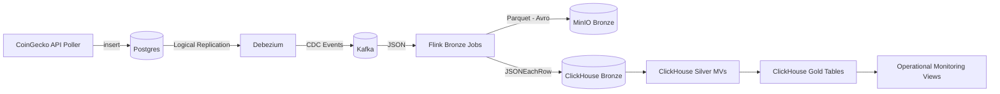

# AetherStream

```mermaid
flowchart LR
  A[CoinGecko API Poller] -->|insert| B[(Postgres)]
  B -->|Logical Replication| C[Debezium]
  C -->|CDC Events| D[(Kafka)]
  D -->|JSON| E[Flink Bronze Jobs]
  E -->|Parquet - Avro| F[(MinIO Bronze)]
  E -->|JSONEachRow| G[(ClickHouse Bronze)]
  G --> H[ClickHouse Silver MVs]
  H --> I[ClickHouse Gold Tables]
  I --> J[Operational Monitoring Views]
```

- `sudo docker compose build flink-base`
- `sudo docker compose build flink-bronze-image`
- `sudo docker compose up -d`