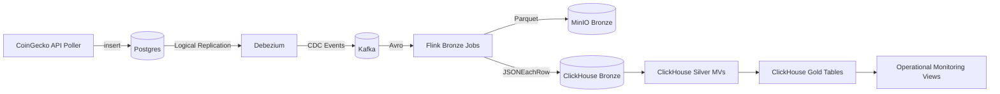

# AetherStream

A change-data-capture pipeline for cryptocurrency market data. It polls the
CoinGecko API into Postgres, streams row changes through Debezium and Kafka,
and lands them in both an object store (Parquet on MinIO) and ClickHouse, where
they are modelled into bronze/silver/gold layers for querying.



## Components

- **Postgres** — source of truth, written by the ingest service. Configured for
  logical replication so Debezium can read the WAL.
- **Debezium / Kafka Connect** — captures inserts on `market_prices` and
  `market_caps` and publishes them to Kafka as Avro, with schemas in the
  Schema Registry.
- **Flink** — two streaming jobs read the CDC topics, parse the Debezium
  envelope, and write each event to three sinks: Parquet on MinIO, an Avro
  topic back on Kafka, and ClickHouse over HTTP.
- **ClickHouse** — holds the warehouse layers (see below).
- **MinIO** — S3-compatible store for the raw Parquet (the landing zone) and
  Flink checkpoints/savepoints.
- **Prometheus + Grafana** — metrics and dashboards, with alert rules defined
  in `grafana/provisioning/alerting/`.

## Data layers (ClickHouse)

| Database | Contents |
|----------|----------|
| `lz`     | Views over the raw Parquet in MinIO (the landing zone). |
| `bronze` | MergeTree tables holding every CDC event, ordered by `(assetId, lsn)`. |
| `silver` | Latest state per asset via `AggregatingMergeTree` + `argMax`. |
| `gold`   | Fact tables, an asset dimension, and a market-overview semantic view. |
| `omt`    | Operational views: pipeline freshness and bronze-vs-landing-zone reconciliation. |

## Prerequisites

- Docker and Docker Compose
- A `.env` file (copy `.env.example` and fill in the values)

## Running

The Flink images are built locally first, then the stack is started:

```sh
docker compose build flink-base
docker compose build flink-bronze-image
docker compose up -d
```

The ingest service polls CoinGecko every 60 seconds (override with
`POLL_INTERVAL`) and the rest of the pipeline flows from there. The connector,
Kafka topics, and MinIO buckets are created by the `*-init` containers on first
start.

Note: the ClickHouse schema in `clickhouse/initdb/` only runs against an empty
data volume. If you change it on an existing volume, re-apply the DDL by hand or
recreate the ClickHouse container.

## Service endpoints

| Service | URL / Port |
|---------|-----------|
| Grafana | http://localhost:3000 |
| Flink JobManager UI | http://localhost:8081 |
| ClickHouse HTTP | http://localhost:8123 |
| MinIO Console | http://localhost:9001 |
| Kafka Connect REST | http://localhost:8083 |
| Schema Registry | http://localhost:8085 |
| Prometheus | http://localhost:9090 |
| Postgres | localhost:5432 |
| Kafka | localhost:9092 |

## Configuration

All credentials and database names come from `.env`. See `.env.example` for the
full list: Postgres, ClickHouse, and MinIO credentials, plus the Grafana admin
login.

## Tests

Java (Flink utilities):

```sh
cd flink/bronze && mvn test
```

Python (ingest service):

```sh
pip install -r tests/requirements.txt -r seed/requirements.txt
pytest tests/unit
```

The smoke tests in `tests/smoke/` query the ClickHouse monitoring views against
a running stack and skip when it is not reachable:

```sh
pytest -m smoke
```

CI runs the Java and Python unit tests on every push and pull request to `main`.
