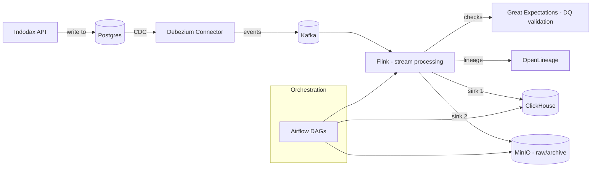

# AetherStream (WIP)

```mermaid
flowchart LR
  A[Indodax API] -->|write to| B[(Postgres)]
  B -->|CDC| C[Debezium Connector]
  C -->|events| D[(Kafka)]
  D --> E[Flink - stream processing]
  E -->|checks| F[Great Expectations - DQ validation]
  E -->|lineage| G[OpenLineage]
  E -->|sink 1| H[(ClickHouse)]
  E -->|sink 2| I[(MinIO - raw/archive)]
  subgraph J[Orchestration]
    K[Airflow DAGs]
  end
  K --> E
  K --> H
  K --> I
```